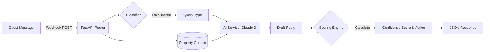

# 🛎️ Nistula Guest Message Handler

> **Nistula Summer 2026 Technical Assessment** — Rajesh Kumar Mishra

[](https://fastapi.tiangolo.com/)
[](https://www.python.org/)
[](https://www.anthropic.com/)
[](https://docs.pytest.org/)

---

## 📖 Overview

A robust, AI-powered FastAPI backend designed to seamlessly process inbound guest messages via webhooks. The system normalises incoming data into a unified schema, intelligently classifies the query type, drafts context-aware replies using the Claude API, and evaluates the response with a deterministic confidence score to recommend the optimal handling action (auto-send, review, or escalate).

---

## ✨ Features

- **Unified Webhook Handler:** A single `POST /webhook/message` endpoint to ingest messages from diverse sources (WhatsApp, Airbnb, Booking.com, Instagram, Direct).
- **Rule-based Classification Engine:** A highly performant, deterministic regex-based classifier prioritizing critical scenarios like complaints.
- **AI-Drafted Replies:** Integration with Anthropic's Claude API to generate empathetic, accurate responses grounded in property-specific context.
- **Deterministic Confidence Scoring:** Algorithmic evaluation of AI responses based on query complexity, missing context, and textual uncertainty.
- **Action Recommendation:** Automatically routes messages based on confidence thresholds (e.g., `auto_send`, `agent_review`, `escalate`).
- **Comprehensive Testing:** Included Pytest suite featuring robust integration tests for classification logic and edge cases.

---

## 🏗️ System Architecture



---

## 📁 Project Structure

```text
nistula-technical-assessment/
├── 📂 src/
│   ├── 📄 main.py                     # FastAPI app entry point & root configurations
│   ├── 📂 routes/
│   │   └── 📄 webhook.py              # POST /webhook/message endpoint handler
│   ├── 📂 models/
│   │   └── 📄 schemas.py              # Pydantic data validation & response models
│   └── 📂 services/
│       ├── 📄 classifier.py           # Rule-based regex query classification engine
│       ├── 📄 property_context.py     # Mock database for property-specific knowledge
│       └── 📄 ai_service.py           # Claude API integration & confidence scoring logic
├── 📂 tests/
│   └── 📄 test_webhook.py             # Pytest integration tests
├── 📄 schema.sql                      # Part 2: PostgreSQL Database Schema
├── 📄 thinking.md                     # Part 3: Written answers & System Design Scenario
├── 📄 requirements.txt                # Python dependencies
├── 📄 .env.example                    # Environment variables template
└── 📄 .gitignore
```

---

## 🚀 Getting Started

Follow these instructions to set up the project locally.

### 1. Prerequisites
- Python 3.9+ installed on your machine.
- An active [Anthropic API Key](https://console.anthropic.com/) to utilize Claude.

### 2. Clone the Repository

```bash
git clone https://github.com/rajeshmishra-11/nistula-technical-assessment.git
cd nistula-technical-assessment
```

### 3. Install Dependencies

It's recommended to use a virtual environment:

```bash
python -m venv venv
source venv/bin/activate  # On Windows use: venv\Scripts\activate
pip install -r requirements.txt
```

### 4. Configure Environment Variables

```bash
cp .env.example .env
```
Edit the newly created `.env` file and insert your Anthropic API key:
```env
ANTHROPIC_API_KEY=sk-ant-api03-...
```

### 5. Run the Development Server

```bash
uvicorn src.main:app --reload
```
- **API Base URL:** `http://localhost:8000`
- **Interactive Swagger Docs:** `http://localhost:8000/docs`

### 6. Run the Test Suite

Execute the integration tests using Pytest:

```bash
python -m pytest tests/ -v
```

---

## 🔌 API Documentation

### `POST /webhook/message`

Ingests a raw message and returns a processed AI response.

**Request Payload:**
```json
{
  "source": "whatsapp",
  "guest_name": "Rahul Sharma",
  "message": "Is the villa available from April 20 to 24? What is the rate for 2 adults?",
  "timestamp": "2026-05-05T10:30:00Z",
  "booking_ref": "NIS-2024-0891",
  "property_id": "villa-b1"
}
```
*Note: Accepted `source` values are `whatsapp`, `booking_com`, `airbnb`, `instagram`, `direct`.*

**Successful Response:**
```json
{
  "message_id": "3f2a91b0-1234-5678-abcd-ef0123456789",
  "query_type": "pre_sales_availability",
  "drafted_reply": "Hi Rahul! Great news — Villa B1 is available from April 20 to 24. The base rate for 2 adults is ₹18,500 per night. Would you like me to help you finalize the booking?",
  "confidence_score": 0.92,
  "action": "auto_send"
}
```

---

## 🧠 Core Logic Deep Dive

### 1. Confidence Scoring & Routing
The confidence score (`0.0` – `1.0`) evaluates system certainty deterministically, independently of the LLM's internal state.

#### Action Thresholds:
- **`≥ 0.85`** ➡️ `auto_send` (Send directly to guest)
- **`0.60 – 0.84`** ➡️ `agent_review` (Human review required before sending)
- **`< 0.60`** ➡️ `escalate` (Flag for human intervention)
- *Note: Any `complaint` triggers immediate `escalate` regardless of score.*

#### Scoring Penalties:
| Condition | Penalty Applied |
|-----------|-----------------|
| Post-sales query missing booking reference | `-0.10` |
| Missing `property_id` (context ungrounded) | `-0.05` |
| Reply too short (< 50 chars) | `-0.15` |
| Reply contains uncertainty phrases ("not sure") | `-0.20` |

### 2. Query Classification Engine
Uses a priority-ordered rule engine rather than expensive LLM calls to classify queries instantly.
1. **`complaint`** (Evaluated first to override everything else)
2. **`post_sales_checkin`** (WiFi, check-in details)
3. **`special_request`** (Transfers, late check-out)
4. **`pre_sales_availability`** (Dates, booking)
5. **`pre_sales_pricing`** (Rates, costs)
6. **`general_enquiry`** (Catch-all for amenities, pets, etc.)

---

## 🛠️ Architecture & Design Decisions

- **Why FastAPI?** Native async support, seamless Pydantic validation, and automatic OpenAPI generation make it the perfect framework for a concurrent webhook handler.
- **Rule-Based vs LLM Classification:** Sending an extra API call to classify a prompt doubles latency and costs. Regex rules ensure 0ms latency, deterministic accuracy, and ease of adding new patterns without prompt-engineering drift.
- **Stateless Webhook:** To maintain strict separation of concerns, the webhook handler is stateless. In production, a persistence layer (repository pattern) would seamlessly integrate post-response processing into a PostgreSQL database.

---

## 📂 Part 2 & Part 3 Submissions

- **Database Schema (Part 2):** Designed for cross-channel guest deduplication and comprehensive AI auditing. See [`schema.sql`](./schema.sql).
- **System Design Scenario (Part 3):** Outlines response protocols for late-night critical escalations and recurring issue prevention. See [`thinking.md`](./thinking.md).

---
*Developed for the Nistula 2026 Technical Assessment.*
